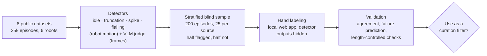
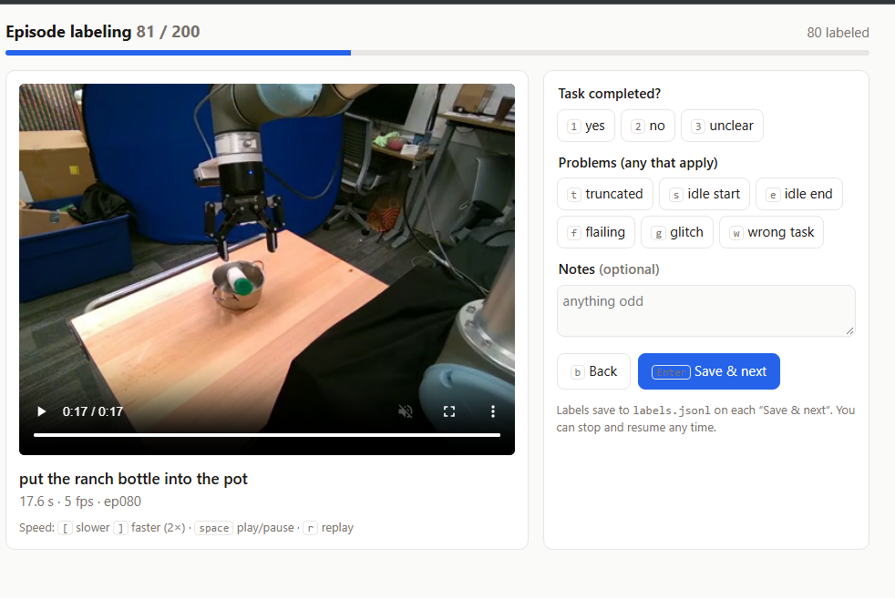
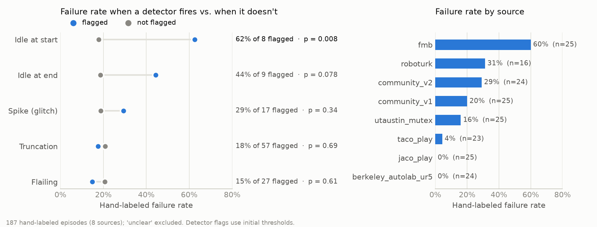

# curated-vla

A small vision-language-action (VLA) model, pretrained only on public robot data, built to answer one question:

> **Does curating public robot data by failure type let a smaller dataset match or beat a larger, uncurated one?**

This extends earlier work on demonstration quality. The output is a trained model, validated quality labels for public datasets, and a controlled curation experiment evaluated closed-loop on LIBERO.

## Approach

| Decision | Choice |
|---|---|
| Framework | [Hugging Face LeRobot](https://github.com/huggingface/lerobot) |
| Architecture | SmolVLA-style: small VLM backbone + action expert (~450M params) |
| Starting point | Pretrained VLM, not robotics-pretrained weights |
| Pretraining data | Public LeRobot community datasets + a slice of Open X-Embodiment |
| Evaluation | LIBERO simulation benchmark, closed-loop, multiple seeds |

## Experiment

Same data size, same post-training, at least 3 seeds per condition:

| Condition | Pretraining data |
|---|---|
| A | Random subset |
| B | Curated subset (flagged episodes removed) |
| C | Full uncurated pool (if compute allows) |

Quality detectors target four failure modes: **truncation**, **idle time**, **flailing**, and **likely task failure** (VLM judge on final frames). Every detector is validated against ~200 hand-labeled episodes and checked for confounding with episode length.

## Status

| Phase | Weeks | Milestone | Status |
|---|---|---|---|
| 0 | 1 | Environment works, published SmolVLA LIBERO numbers reproduced, compute estimated | ✅ [report](docs/phase0.md): 72.2% avg, matches community reproduction; paper's 87.3% not reached |
| 1 | 2–3 | Data audited, quality detectors validated | ✅ [report](docs/phase1.md): idle and failure-judge filters validated (failure judge held-out AUROC 0.93); truncation/flailing/spike did not |
| 2 | 4–5 | Baseline model pretrained, post-trained, benchmarked | ⏳ |
| 3 | 6–8 | Curated vs random results | ⏳ |
| 4 | 9–10 | Per-filter ablations and dose-response | ⏳ |
| 5 | 11–12 | Repo, preprint, model + label release, video | ⏳ |

Full plan: [docs/PLAN.md](docs/PLAN.md)

### What Phase 0 matched

The Phase 0 gate verifies the **evaluation harness**, by matching an independent reproduction of the public `HuggingFaceVLA/smolvla_libero` checkpoint. It does **not** match the SmolVLA paper.

| LIBERO success % | Spatial | Object | Goal | Long | Avg |
|---|---|---|---|---|---|
| SmolVLA paper (0.45B, Table 2) | 90 | 96 | 92 | 71 | 87.3 |
| Community reproduction, same public checkpoint ([lerobot#3264](https://github.com/huggingface/lerobot/issues/3264)) | 63 | 93 | 81 | 56 | 73.3 |
| Ours, same public checkpoint, seed 1000 | 75 | 90 | 78 | 46 | 72.2 |
| **Gap: community − paper** | −27 | −3 | −11 | −15 | **−14.0** |
| **Gap: ours − community** | +12 | −3 | −3 | −10 | **−1.1** |

The public checkpoint scores about 14 points below the paper's headline when others evaluate it too, so we treat that gap as belonging to the checkpoint/paper rather than our harness. (The paper's own ablation, Table 13, reports ~80–83% average.) **The training pipeline is verified separately in Phase 2**: we post-train `lerobot/smolvla_base` on LIBERO with our settings as a control, and stop to debug if it does not land near published numbers.

## Phase 1: How the quality detectors are validated

A curation filter is only worth testing if it removes episodes a person would agree are bad. So before any detector is used to filter training data, it is checked against blind hand labels.



1. **Audit** (`python -m curation.audit`): load every episode's actions and states from 8 sources and compute motion-based scores, normalized per sub-dataset so different robots are comparable. Every score is checked for confounding with episode length.
2. **Sample** (`python -m curation.sample_for_labeling`): draw 200 episodes, 25 per source. Half come from flagged episodes (spread across detectors so rare ones get enough positives) and half from unflagged ones, then the order is shuffled.
3. **Label** (`python -m curation.label_server`): a keyboard-driven local app plays each episode's main-camera clip next to its instruction. The labeler marks whether the task was completed and any visible problems. Detector outputs never reach the page.
4. **Validate** (`python -m curation.validate`): compare each detector with the labels, test whether flags predict task failure, repeat within episode-length bins, and reweight to the full population.



### Results (200 labeled episodes)



- **Task failure is the dominant human-visible problem**: 19% of episodes, concentrated in a few sources (fmb 60%, roboturk 31%, community_v2 29%). The HF-filtered community_v1 fails less often than the unfiltered v2 (20% vs 29%, small n).
- **Idle time at the start predicts failure**: 62% of flagged episodes fail, vs 18% of unflagged (odds ratio 7.7, p = 0.008, n = 8 flagged). Idle at the end trends the same way (p = 0.08).
- **The idle detectors are validated.** The first pass labeled "idle" only when the robot never moved, so a second blind pass of 40 episodes used the detector's own definition (> 3 s still). Idle at start matched the labels exactly (10 of 10, κ = 1.00); idle at end reached κ = 0.75, with every disagreement within 0.8 s of the 3 s threshold.
- **Truncation, flailing and spike detectors did not validate.** The labeler saw almost none of the problems they flag (1 truncation in 200; no flailing or glitches), and their flags do not predict failure. They will not be used as filters as-is.
- **The VLM failure judge went from weak to validated.** First + last frames gave AUROC 0.69; 8 frames from across the episode raised it to 0.84 (Qwen3-VL-8B, 4-bit), with frame count mattering more than model size. Because that choice was made on the same labels, the configuration was fixed in advance and checked on **100 fresh, randomly drawn episodes: AUROC 0.93 (95% CI 0.82–1.00)**. Only 9 of those episodes failed (6 from fmb), so the lower bound is the safer number.

Full details: [docs/phase1.md](docs/phase1.md). Labels: [labels/phase1/](labels/phase1/) (200-episode pass), [labels/phase1_idle/](labels/phase1_idle/) (idle pass) and [labels/phase1_completion/](labels/phase1_completion/) (held-out failure-judge check).

## Layout

```
configs/    training and eval configs
curation/   quality detectors and episode labeling
eval/       LIBERO evaluation and result aggregation
labels/     hand labels used to validate the detectors
scripts/    setup, environment checks, utilities
docs/       plan, audit reports, write-up
```

## Getting started

```bash
python scripts/check_env.py
```

## Ground rules

- Reproduce published numbers before trusting our own evaluation.
- Same data size, same post-training, multiple seeds for every comparison.
- Fixed seeds; no cherry-picked rollouts in videos.
- Null results are reported as clearly as positive ones.
- Results are on LIBERO simulation only; no real-robot claims.
